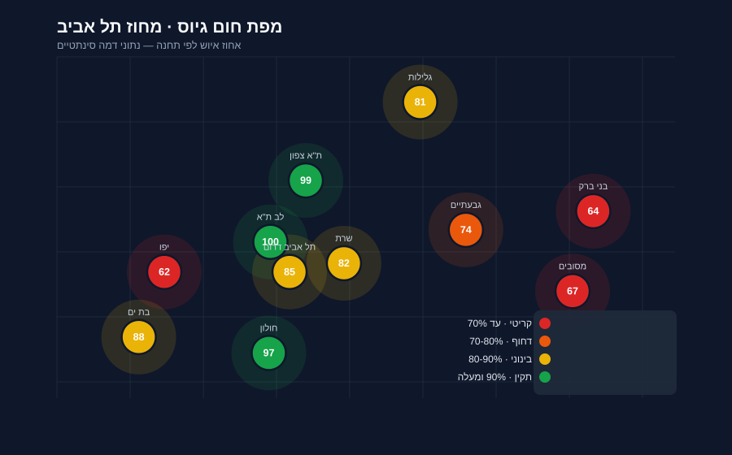

<div dir="rtl">

# 🗺️ מפת חום גיוס ואיוש

> מערכת BI גאוגרפית לניהול פריסת מגייסים מול פערי האיוש בתחנות משטרה.
> אפליקציית ווב מלאה: מפת חום בארבע רמות, המלצה לפי יישוב, לוח משרות,
> לוח בקרה, סטטוס תחנות, התראות וניהול נתונים. מותאמת מלאה לנייד.



> ### ⚠️ הבהרת נתונים
> **כל מספר במאגר הזה מוגרל.** אחוזי האיוש, התקן מול המאויש, פילוח התפקידים,
> הדמוגרפיה, המועמדים בהליך, זמני הנסיעה ו-12,292 שורות המשרה — כולם מהתפלגות
> נורמלית עם `seed` קבוע. אף קובץ תפעולי אינו נקרא בשום שלב.
>
> הדבר היחיד האמיתי הוא **גאוגרפיה ציבורית**: שמות תחנות, מחוזות ומרחבים,
> שמות יישובים והקואורדינטות שלהם.
>
> איך זה נבנה — ולמה דווקא כך — מוסבר ב-[`tools/README.md`](tools/README.md).

**🔗 הדגמה חיה:** https://nadavbenmenan.github.io/geo-heatmap-demo/

---

## 💡 הבעיה העסקית

גיוס כוח אדם למשטרה הוא בעיה **מרחבית**, לא רק מספרית. למנהל גיוס ארצי יש שתי שאלות פתוחות בו-זמנית:

1. **היכן העומס החמור ביותר?** באילו תחנות פתוחות הכי הרבה משרות, ובאילו מקצועות?
2. **מאיפה לגייס?** אילו יישובים נמצאים במרחק נסיעה סביר מהתחנות החסרות — כלומר לאן להפנות תקציב פרסום ולתכנן ימי גיוס?

מערכת אקסל שטוחה עונה על השאלה הראשונה בלבד. המערכת הזו מחברת את שתיהן: היא צובעת כל תחנה
לפי חומרת הפער ומצליבה אותה מול היישובים שבטווח, כדי שההחלטה "לאן לשלוח מגייס" תתקבל על מפה
ולא על טבלה.

---

## ✨ מה יש במערכת

| מסך | מה הוא עושה |
|------|-------------|
| **מפת חום תחנות** | מפת חום אינטראקטיבית (Leaflet) ב‑**ארבע רמות**: תחנות · יחידות · מרחבים · יישובים. כל ישות נצבעת לפי אחוז האיוש, ולחיצה חושפת את הצד השני של הקשר — מי בטווח 30 דק', מה החוסר לפי משפחת תפקיד, וכמה מועמדים בהליך. |
| **המלצה לפי יישוב** | הכיוון ההפוך של מפת החום: מקלידים שם יישוב, ומקבלים לכל אחד משלושת תפקידי הליבה (סייר · חוקר · בלש) את התחנה שבטווח הנסיעה שחסר לה הכי הרבה בתפקיד הזה. כל שורה נפתחת לכרטיס התחנה המלא. |
| **לוח משרות לגיוס** | המשרות שאפשר לגייס אליהן, ברמת המשרה הבודדת: מספר משרה, סוג משרה (רגיל / סטודנט), היקף, תיאור עיסוק, סיווג, דרגה ורמות ההיררכיה. סינון לפי תפקיד, אזור, אגף ויחידה, ולצדם **סינון יחידה** — תחנות · מרחבים · יחידות עניין · שלושתם. |
| **לוח בקרה** | בורר תפקידי ליבה / תפקידי מטה. התפקידים שהכי חסרים, איפה הפער הגדול ביותר לפי תפקיד, היחידות המרוקנות ביותר, פילוח דמוגרפי לפי תפקיד, Top‑5 קריטיות, ציון דחיפות שקוף, מפת יעדי פרסום וימי גיוס. |
| **סטטוס תחנות** | עץ היררכי מחוז → מרחב → תחנה, עם המדדים הארציים ופירוט מלא לכל תחנה. |
| **התראות** | מי *נכנס* לסטטוס קריטי ומי *יצא* ממנו — ולא רק מי קריטי עכשיו. יומן שינויי סטטוס עם נקודת השוואה שנשמרת. |
| **הגדרות** | ארבע לשוניות: ניהול נתונים (7 מערכי נתונים), ספי צבע ומרחק, טעינת אקסלים עם Data Guard, ו**ענן ושיתוף** — חשבונות הגוגל המורשים ודוח המוכנות להעלאה (התשתית קיימת ומנותקת; המערכת אינה בענן). בתוכה גם **מבנה הנתונים · בדיקה עצמית** — כל טבלה במאגר, המספר שבה מול המספר שהמסך מציג, והפער ביניהם אם קיים. |

> בגרסת ההדגמה הסטטית הזו הצפייה מלאה בכל המסכים. פעולות הכתיבה (טעינת אקסל, עריכה,
> שמירת הגדרות) קיימות בגרסת השרת המלאה ומוקפאות כאן.

---

## 🧠 החלטות טכניות

מה שמעניין בפרויקט הוא לא שהקוד רץ, אלא **למה הוא בנוי כך**. שלוש החלטות מרכזיות:

### 1. טבלת קשרים במקום חישוב מרחק גאוגרפי
"יישוב קרוב לתחנה" מוגדר לפי **זמן נסיעה בפועל**, לא מרחק אווירי. שתי נקודות במרחק 3 ק"מ יכולות
להיות 8 דקות או 25 דקות זו מזו, תלוי בכבישים ובעומס. לכן הקשרים יושבים בטבלה מפורשת
(`station_settlement` עם עמודת `travel_min`), והסינון "עד 30 דק'" הוא שאילתה ישירה על העמודה —
`WHERE travel_min <= 30` — ולא חישוב `haversine` בזמן ריצה. היתרונות: הנתון ניתן לתיקון ידני
כשמסלול מסוים חריג, הוא מקור אמת יחיד לכל המסכים, והוא לא תלוי בשירות ניתוב חיצוני בזמן צפייה.

### 2. Data Guard — שכבת הגנה על טעינות
טעינת אקסל שגוי יכולה למחוק חודשי עבודה בלחיצה. **Data Guard** דוחה כל קובץ שסוטה ביותר מ-10%
מהנתונים הקיימים (למשל קובץ שמכיל 12 תחנות במקום 88 — כנראה קובץ חלקי או שגוי), ולפני כל טעינה
מוצלחת נשמר גיבוי אוטומטי. זו אינה זהירות יתר: מסך הניהול מאפשר מחיקה בלחיצה ואין "בטל" — הגיבוי
הוא הדרך היחידה לחזור.

### 3. "מצב ריק מפורש" — לעולם לא אפס במקום חוסר נתון
כלל הברזל של המערכת: **היכן שאין נתון — מוצג "אין נתונים", לעולם לא 0**. אפס מועמדים ("אף אחד
לא בהליך") הוא מסקנה שונה לגמרי מ"לא נטען קובץ מועמדים". לכן `null` ו-`0` מטופלים בנפרד בכל
מסך, וכרטיס בלי נתון מציג תווית מפורשת ולא מספר. החלטה עסקית שגויה על בסיס אפס מזויף גרועה
מהחלטה שנדחתה בהיעדר נתון.

### 4. שורה למשרה, ולא ספירה
קובץ התקן והמצבה נשמר ברזולוציית **המשרה הבודדת** ולא כסיכום. הסיבה מעשית: "חסרים 12 סיירים
במרחב שרון" אינו משימה — רשימת שתים‑עשרה המשרות עם מספריהן היא. סיכום אינו יכול להחזיר את
המספרים אחרי שאבדו.

על אותן שורות נשאלות שתי שאלות שונות, ולכל אחת כלל משלה: *אחוז האיוש* מחושב על **כל** התקנים
(משרה מוקפאת עדיין תופסת תקן), ואילו *אילו משרות אפשר לגייס אליהן* מסונן לפי מצב המשרה וסיווגה.
ערבוב השניים היה נותן או אחוז שגוי או רשימת משימות שאי אפשר לפעול לפיה — ולכן הם נשמרים
בעמודות נפרדות.

### עקרונות משלימים
- **מקור אמת יחיד לצבעים:** הסטטוס והצבע מחושבים בשרת (`ingest/colors.py`) ונשלחים ללקוח
  מוכנים — כדי שהמפה, המקרא, הטבלאות והייצוא לא יוכלו לסטות זה מזה. בהדגמה הזו אין שכפול של
  הכלל: הצבעים מגיעים מאותו קוד, מוקפאים לתוך קובצי ה-JSON.
- **ציון דחיפות שקוף:** `(100 − אחוז_איוש) × מקדם_קריטיות × (1 + תקנים_חסרים/10)`. הנוסחה
  והמקדמים מוצגים במסך עצמו וניתנים לכוונון בהגדרות, כי מנהל שמקצה תקציב לפי ציון חייב לדעת
  איך הוא התקבל.
- **התראה על מעבר, לא על מצב:** "מי קריטי עכשיו" אפשר לחשב בכל רגע; "מי *נכנס* לקריטי" מחייב
  לזכור מה היה. לכן נשמרת נקודת השוואה, והצפייה הראשונה בישות רק זורעת אותה — אחרת בהתקנה
  טרייה כל התחנות הקריטיות היו מדווחות כאילו נכנסו לקריטי הרגע.
- **נייד ראשון בפועל:** מתחת ל-620px כל שורת טבלה נפרשת לכרטיס "תווית: ערך", כשהתווית מגיעה
  מ-`data-th` שעל התא עצמו — ולא מ-`nth-child` שנשבר ברגע שמזיזים עמודה.

---

## 🏗️ ארכיטקטורה

<div dir="ltr">

```
┌─────────── גרסת השרת המלאה ───────────┐   ┌──── גרסת הפורטפוליו (כאן) ────┐

  Excel ──► ingest/ (pandas + Data Guard)     tools/build_demo_db.py
              │  נרמול · ולידציה · גיבוי           │  (מגריל מאגר שלם)
              ▼                                    ▼
          SQLite (db/heatmap.db)               SQLite (db/demo.db)
              │                                    │
              │                              tools/freeze_demo_api.py
              │                                    │  (מריץ את השרת האמיתי)
              ▼                                    ▼
          Flask API  /api/*  (app.py)          data/*.json  (קפוא)
              │                                    │
              ▼                                    ▼
     Leaflet + Vanilla JS (web/) ◄── אותו app.js בדיוק ──► + demo.js
```

</div>

**למה סטטי לפורטפוליו?** מפת החום היא קריאה‑בלבד, ולכן אפשר לוותר על Flask בזמן צפייה.

**ומה חדש כאן:** הגרסה הזו לא מחקה את השרת — היא **מריצה אותו**. `build_demo_db.py`
בונה SQLite עם אותה סכימה בדיוק וממלא אותו במספרים מוגרלים; `freeze_demo_api.py`
מפעיל את שרת ה‑Flask האמיתי מול המאגר הזה ושומר כל תשובה כקובץ. לכן `app.js` כאן
**זהה בייט‑לבייט** לזה שעל השרת, וכל ההתאמה לאירוח סטטי יושבת בקובץ אחד קטן —
[`demo.js`](demo.js).

הגישה הקודמת (מחולל JSON שמחקה את ה‑API ביד) נשברה: כל שינוי במערכת חייב עדכון
מקביל במחולל, זה לא קרה, והדמו נתקע בגרסה ישנה של הממשק. עכשיו מי שמייצר את
התשובות הוא הקוד האמיתי — ועדכון הדמו הוא שלוש הרצות ובדיקה.

והבדיקה אינה "נכתבו הקבצים": `tools/verify_demo.py` מריץ את **אותה בקשה** בשני
הצדדים — בשרת האמיתי מול `demo.js` על הקבצים הקפואים — ומשווה את התשובות. סינון
שנשאר מאחור מופיע שם כהפרש במספר, ולא כמסך שנראה תקין ומציג נתון של סינון אחר.

---

## 🛠️ מחסנית טכנולוגית

- **Frontend:** Vanilla JavaScript (ללא framework), Leaflet.js למפה, CSS מותאם (RTL, עברית מלאה)
- **Backend (גרסה מלאה):** Python · Flask · SQLite
- **עיבוד נתונים:** pandas · שכבת נרמול ושידוך שמות · Data Guard
- **הדגמה:** ייצוא סטטי ל-JSON · GitHub Pages · **אפס תלויות ריצה בצד לקוח**

---

## 🚀 הרצה מקומית

הדגמה סטטית — כל שרת קבצים סטטי יספיק:

<div dir="ltr">

```bash
# מהתיקייה הזו:
python -m http.server 8000
# ואז בדפדפן: http://localhost:8000
```

</div>

לחידוש נתוני ההדגמה (הגרלה מחדש עם seed שונה) — ראו [`tools/README.md`](tools/README.md).
שני הסקריפטים שבונים את הנתונים חיים בפרויקט המלא, כי הם מריצים את שרת ה‑Flask האמיתי.

---

## 📂 מבנה התיקייה

<div dir="ltr">

```
.
├── index.html                    # מבנה המסכים (7 מסכים)
├── app.js                        # זהה בייט-לבייט ל-web/app.js שעל השרת
├── demo.js                       # שכבת ההדגמה — הקובץ היחיד שמבדיל
├── style.css                     # עיצוב RTL + התאמה לנייד
├── auth.js · auth.css            # שער הכניסה של הענן. יוצא מיד כשאין
│                                 #   פרטי Firebase בעמוד — וכאן אין
├── vendor/                       # Leaflet (מקומי, ללא CDN)
├── data/                         # תשובות ה-API, קפואות (385 קבצים)
│   ├── stations.json  settlements.json  relations.json  regions__heat.json
│   ├── admin-positions.json  alerts.json  dashboard.json  recruiter.json …
│   ├── station-detail/           # פירוט לכל תחנה (88)
│   ├── settlement-advice/        # המלצה לכל יישוב (255)
│   └── *__by-*.json              # נקודות קצה שהפרמטר משנה בהן את התשובה
└── tools/
    ├── README.md                 # איך נוצרו הנתונים
    └── geo_seed.json             # גאוגרפיה ציבורית (שמות + קואורדינטות)
```

</div>

---

<sub>נבנה כפרויקט הדגמה ל-BI Developer / Data Analyst. הקוד המלא (שרת, עיבוד, בדיקות) קיים בגרסת השרת;
מאגר זה הוא תצוגת הפורטפוליו הסטטית שלו, עם נתונים מומצאים בלבד.</sub>

</div>
